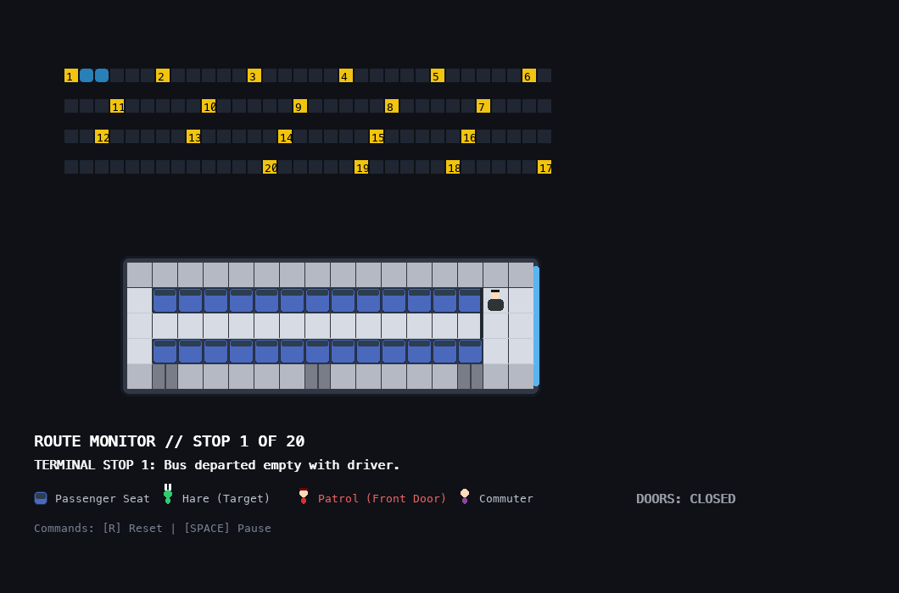

# Spatial Bottleneck & Inspection Policy Audit in Transit Topologies

A discrete agent-based simulation framework modeling passenger turnover dynamics, aperture constraints, and inspection coverage efficacy within articulated transit vehicles.

## Research Objectives
- **Spatial Vulnerability Mapping:** Evaluating how interior layouts (cabin dividers, seating rows, aisle widths) create visual occlusion zones.
- **Ingress Strategy Analysis:** Benchmarking single-door entry versus multi-aperture coordinated sweeps against dynamic commuter flow.
- **Adversarial Benchmark Modeling:** Deploying non-validated benchmark nodes to stress-test detection probability and identify unmonitored egress paths.

## Key Metrics
- **Interception Rate:** Percentage of non-validated agents inspected prior to terminal disembarkation.
- **Slippage Frequency:** Probability of an agent exploiting single-door entry latency to egress through alternate apertures.

DOI: https://doi.org/10.13140/RG.2.2.33086.24640
