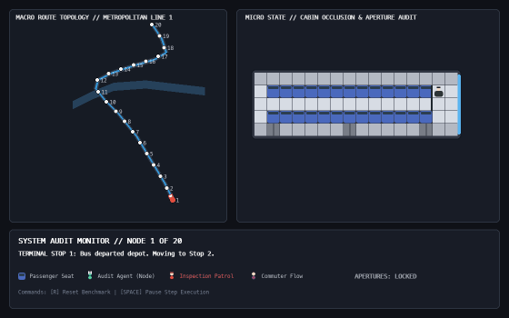

# Spatial Bottleneck & Inspection Policy Audit in Transit Topologies

A coupled continuous-discrete simulation framework for modeling passenger turnover dynamics, spatial occlusion zones, aperture constraints, and inspection coverage efficacy within urban transit vehicles.

---

## 🚀 Dual-Scale Macro-Micro Simulation Framework

The repository features two evaluation engines: the continuous dual-scale model (`Euclidean_dimension.py`) and the baseline discrete grid automaton (`bus_grid_player.py`).

| **Continuous Dual-Scale Model (`macro_micro_simulation.gif`)** | **Baseline Discrete Model (`simulation.gif`)** |
|:---:|:---:|
|  |  |
| *2D Euclidean Street Map coupled with Micro Cabin Audit* | *Discrete Grid Automaton (Baseline)* |

---

## 📐 Model Evolution & Architecture

### 1. Macro-Micro Engine (`Euclidean_dimension.py`)
Operates simultaneously across two spatial scales:
* **Macro Scale (2D Street Network):**
  * Uses arc-length parameterization along a continuous 2D polyline urban route with turns and river crossings.
  * Dynamically computes vehicle position `(x, y)` and heading orientation angle `θ = atan2(Δy, Δx)`.
  * Tracks 20 discrete transit nodes (stops) from initial to final terminal.
* **Micro Scale (Vehicle Interior Topology):**
  * Models structural blind spots created by the driver cabin partition.
  * Simulates sliding aperture mechanics (Front, Middle, Rear doors).
  * Executes stochastic passenger exchange and enforcement sweep triggers.

### 2. Baseline Discrete Engine (`bus_grid_player.py`)
* Serves as the initial single-scale spatial bottleneck benchmark.
* Uses a discrete cellular grid to evaluate local corridor congestion and single-door ingress latency.

---

## 🎯 Research Objectives
* **Spatial Vulnerability Mapping:** Quantifying how interior physical barriers (driver cabin dividers, seat layout) generate visual occlusion zones and inspection shadows.
* **Ingress Strategy Analysis:** Benchmarking single-door entry versus multi-aperture coordinated sweeps under dynamic commuter flows.
* **Adversarial Benchmark Modeling:** Deploying non-validated benchmark agents (emerald green) to stress-test detection probability and identify unmonitored exit paths during patrol sweeps.

---

## 📊 Key Metrics
* **Interception Rate ($P_{det}$):** Percentage of non-validated agents detected prior to terminal disembarkation.
* **Slippage Frequency ($P_{slip}$):** Probability of an uninspected agent exploiting single-door entry latency to egress through alternate apertures.
* **Occlusion Coverage Penalty:** Latency added to inspection sweeps due to visual obstruction behind the driver cabin.

---

## 🛠️ Repository Structure

```text
.
├── Euclidean_dimension.py      # Dual-scale continuous macro-micro simulation (Main)
├── bus_grid_player.py          # Discrete single-scale grid simulation (Baseline)
├── bus_grid.py                 # Core grid engine components
├── macro_micro_simulation.gif  # Dual-scale execution recording
└── simulation.gif              # Baseline execution recording
