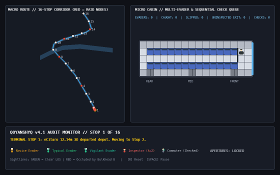

# Spatial Bottleneck & Inspection Policy Audit in Transit Topologies

[](https://github.com/AlibekBekzhigitov/Qoyanshyq)
[](https://github.com/AlibekBekzhigitov/Qoyanshyq)
[](https://www.python.org/)
[](https://doi.org/10.13140/RG.2.2.33086.24640)
[](https://doi.org/10.13140/RG.2.2.19446.56641)

A coupled continuous-discrete simulation framework (**Qoyanshyq Engine**) for modeling passenger turnover dynamics, spatial occlusion zones, aperture constraints, and inspection coverage efficacy within urban transit vehicles — spanning both **single-agent timing races (v1.0–v3.2)** and **multi-evader, route-level verification queues (v4.1)**.

---

## 🚀 Visual Simulation Progression (v1.0 → v3.0 → v4.1)

| **Multi-Evader & Queue Audit (`macro_micro_v4.gif`, v4.1)** | **Single-Agent Dual-Scale (`macro_micro_simulation.gif`, v3.0)** | **Baseline Grid Automaton (`simulation.gif`, v1.0)** |
|:---:|:---:|:---:|
|  |  |  |
| *16-Stop Corridor, $E=3$ Profiles, LOS Rays & Ticket Queue* | *20-Stop Euclidean Route + Single Audit Node* | *Single-Scale Discrete Cellular Grid* |

---

## 📐 Model Evolution & Architecture

### Part I — Single-Evader Foundation (v1.0 – v3.2)

#### 1. Paired CRN Monte Carlo Coverage Audit (`TrialModelBus/upd_montecarlo_bus_standart.py` — v3.2)
Anchors the interior timing-race and line-of-sight model to five public Daimler Buses **Mercedes-Benz Citaro / eCitaro** configurations ($W = 2.55\,\text{m}$, driver bulkhead $\mathcal{B} = [0.0, 2.0] \times [0.95, 2.55]\,\text{m}$):
- **Common Random Numbers (CRN) Ablation:** Separates the opaque driver bulkhead's effect into a passenger early-warning suppression channel ($\Delta P_{\text{pass}}$), an inspector sightline occlusion channel ($\Delta P_{\text{insp}}$), and their interaction across Weidmann (1993) density regimes.
- **$t_{\text{blind}}$ Tipping-Point Sweep:** Evaluates deterministic inspector re-acquisition delays ($0.0\text{--}5.0\,\text{s}$) to locate exact sign-flip thresholds across vehicle lengths and door layouts (verified robust to interior bulkhead sampling exclusion via `check_bulkhead_artifact.py`).
- **Sequenced Aperture Control (`Interlocked Boarding`):** Evaluates secondary-door release delays ($\tau \in \{0, 2, 3, 4, 5, 6, 8\}\,\text{s}$) without increasing squad size ($k = 2$).
- **Multi-Seed Robustness:** Verifies cross-seed invariance across 5 independent master seeds (`20261009..20261013`, $50{,}000$ trials/cell).

#### 2. Single-Agent Macro-Micro Engine (`Euclidean_dimension.py` — v3.0)
Operates simultaneously across two spatial scales:
- **Macro Scale (2D Street Network):** Arc-length parameterization along a continuous 2D polyline urban route with turns, river crossing, and 20 discrete stop nodes.
- **Micro Scale (Vehicle Interior Topology):** Structural blind spots created by the driver cabin partition, sliding aperture mechanics (`Front`, `Mid`, `Rear`), and stochastic single-agent patrol sweeps.

#### 3. Baseline Discrete Engine (`bus_grid_player.py` — v1.0)
- Initial single-scale spatial bottleneck benchmark evaluating local corridor congestion and single-door ingress latency on a discrete grid.

---

### Part II — Multi-Evader & Route-Level Extension (v4.1)

#### 4. Single-Stop Sequential Verification Audit (`MultipleEvaders/V4A_slipscale/qoyanshyq_v4a_newscale.py` — v4a)
Extends the v3.2 single-stop engine to $E = 3$ heterogeneous fare evaders embedded in a compliant passenger flow (`load` $\in \{0.2, 0.5, 0.8\}$):
- **Indistinguishable Verification Queue:** Inspectors cannot visually distinguish evaders from paying riders and spend $\mu_s = 5.0\,\text{s}$ per ticket check sequentially (`nearest`, `sweep`, or `random` target selection).
- **Behavioral Profiles & Seat Choice:** Contrasts `Novice` ($p_{\text{miss}} = 0.20$), `Typical` (v3.2 baseline), and `Vigilant` ($\beta = 3.0$ logit seat preference) populations, partitioning outcomes into **Slipped**, **Checked**, and **Remaining Aboard** at dwell expiration.

#### 5. Multi-Stop Route Dynamics & Coverage Gap Mapping (`MultipleEvaders/V4A_gapcoverage/v41_route_final.py` — v4b)
Carries uninspected riders across a **16-stop urban route** with inter-stop transit legs, stochastic raid arrivals ($q$), and full-route Weidmann crowding:
- **Patrol Scarcity vs. Cabin Geometry:** Decomposes total evasion into *Never Encountered* ($\approx 43\%$) and *Evaded Active Raid* ($\approx 47\text{--}52\%$).
- **Crowding Sign-Reversal:** Demonstrates that while high cabin load shields evaders during a single stop via ticket-check queuing (`v4a`), sustained route-level crowding increases conditional capture during raids (`13.4% → 16.2%` in Class-I) due to Weidmann egress impedance.
- **2D Spatial Coverage Gap Heatmaps:** Maps localized capture deficits behind the driver bulkhead and articulated bellows (`v4b_coverage_gap_heatmap.png`).

#### 6. Multi-Evader Dual-Scale Visualizer (`BusRouteSimulation/new_simulation_multiple_evaders.py` — v4.1)
- Coupled 16-stop macro-micro simulator rendering concurrent `Novice`, `Typical`, and `Vigilant` evaders, real-time line-of-sight rays (`GREEN` clear vs. `RED` bulkhead-occluded), door-holding constraints, and sequential ticket-check queues (`macro_micro_v4.gif`).

---

## 📊 Key Benchmark Results

### Table 1 — Single-Evader Baseline & Sequenced Interlock (v3.2, $n = 10{,}000$/cell, seed `20261009`)

| Vehicle Class | Length / Doors | Policy | $P_{\text{slip}}$ (%) | 95% Wilson CI | 5-Seed Mean ± SD (%) | Interlock $\tau = 8\,\text{s}$ (%) |
| :--- | :---: | :--- | :---: | :---: | :---: | :---: |
| **Class-I** (Citaro K) | $10.63\,\text{m}$ / 2D | `single_door` | 87.28 | [86.61, 87.92] | 87.01 ± 0.49 | **53.15** ($-34.13\,\text{pp}$) |
| | | `independent_random` | 36.53 | [35.59, 37.48] | 36.74 ± 0.54 | — |
| | | `distinct_random` | 0.00 | [0.00, 0.04] | 0.00 ± 0.00 | — |
| **Class-IIa** (eCitaro) | $12.14\,\text{m}$ / 2D | `single_door` | 89.61 | [89.00, 90.19] | 89.03 ± 0.41 | **61.42** ($-28.19\,\text{pp}$) |
| | | `independent_random` | 35.94 | [35.01, 36.89] | 35.53 ± 0.59 | — |
| | | `distinct_random` | 0.00 | [0.00, 0.04] | 0.00 ± 0.00 | — |
| **Class-IIb** (eCitaro) | $12.14\,\text{m}$ / 3D | `single_door` | 88.77 | [88.14, 89.37] | 88.88 ± 0.24 | **60.87** ($-27.90\,\text{pp}$) |
| | | `independent_random` | 73.91 | [73.04, 74.76] | 74.12 ± 0.55 | — |
| | | `distinct_random` | 67.83 | [66.91, 68.74] | 68.36 ± 0.38 | — |
| **Class-IIIa** (eCitaro G) | $18.13\,\text{m}$ / 3D | `single_door` | 95.06 | [94.62, 95.47] | 95.03 ± 0.11 | **76.81** ($-18.25\,\text{pp}$) |
| | | `independent_random` | 68.70 | [67.78, 69.60] | 69.07 ± 0.35 | — |
| | | `distinct_random` | 62.56 | [61.61, 63.50] | 62.63 ± 0.61 | — |
| **Class-IIIb** (eCitaro G) | $18.13\,\text{m}$ / 4D | `single_door` | 94.99 | [94.54, 95.40] | 95.14 ± 0.24 | **77.23** ($-17.76\,\text{pp}$) |
| | | `independent_random` | 81.90 | [81.13, 82.64] | 82.17 ± 0.26 | — |
| | | `distinct_random` | 79.81 | [79.01, 80.59] | 79.61 ± 0.27 | — |

### Table 2 — Multi-Evader Single-Stop Queue vs. Full-Route Outcomes (v4a & v4b, Citaro Specs)

| Vehicle Class | v4a Single-Stop `single_door` (`Load=0.5`, $E=3$) | v4a `distinct_random` (`Load=0.5`, $E=3$) | v4b 16-Stop Route (`Load=0.45`, $\beta=2.0$) | v4b Route (`Load=0.75`, $\beta=2.0$) |
| :--- | :---: | :---: | :---: | :---: |
| | *Slipped / Checked / Aboard (%)* | *Slipped / Checked / Aboard (%)* | *Caught / Evaded Raid / Never Seen (%)* | *Caught / Cond. Catch (%)* |
| **Class-I** (10.63m 2D) | 88.00 / 8.07 / 3.93 | 0.00 / 29.12 / **70.88** | 7.92 / 48.48 / 43.60 | **9.14** / **16.19** |
| **Class-IIa** (12.14m 2D) | 88.30 / 6.70 / 5.00 | 0.00 / 24.82 / **75.18** | 7.53 / 47.77 / 44.70 | **8.70** / **15.43** |
| **Class-IIb** (12.14m 3D) | 88.80 / 6.63 / 4.57 | 85.03 / 9.78 / 5.18 | 7.33 / 48.56 / 44.11 | **8.14** / **14.32** |
| **Class-IIIa** (18.13m 3D) | 91.48 / 3.78 / 4.73 | 86.00 / 6.62 / 7.38 | 4.55 / 51.88 / 43.56 | **5.47** / **9.78** |
| **Class-IIIb** (18.13m 4D) | 91.10 / 4.08 / 4.82 | 89.62 / 5.18 / 5.20 | 4.77 / 51.76 / 43.47 | **4.89** / **8.77** |

---

## ⚡ Quickstart & Reproduction

```bash
git clone [https://github.com/AlibekBekzhigitov/Qoyanshyq.git](https://github.com/AlibekBekzhigitov/Qoyanshyq.git)
cd Qoyanshyq
pip install numpy pandas matplotlib pygame imageio

# 1. Single-Evader CRN Audit (v3.2)
python TrialModelBus/upd_montecarlo_bus_standart.py

# 2. Multi-Evader Single-Stop Verification Queue Audit (v4a)
python MultipleEvaders/V4A_slipscale/qoyanshyq_v4a_newscale.py

# 3. Multi-Stop Route Dynamics & Coverage Gap Heatmap (v4b)
python MultipleEvaders/V4A_gapcoverage/v41_route_final.py

# 4. Interactive Dual-Scale Multi-Evader Visualization (v4.1)
python BusRouteSimulation/new_simulation_multiple_evaders.py
